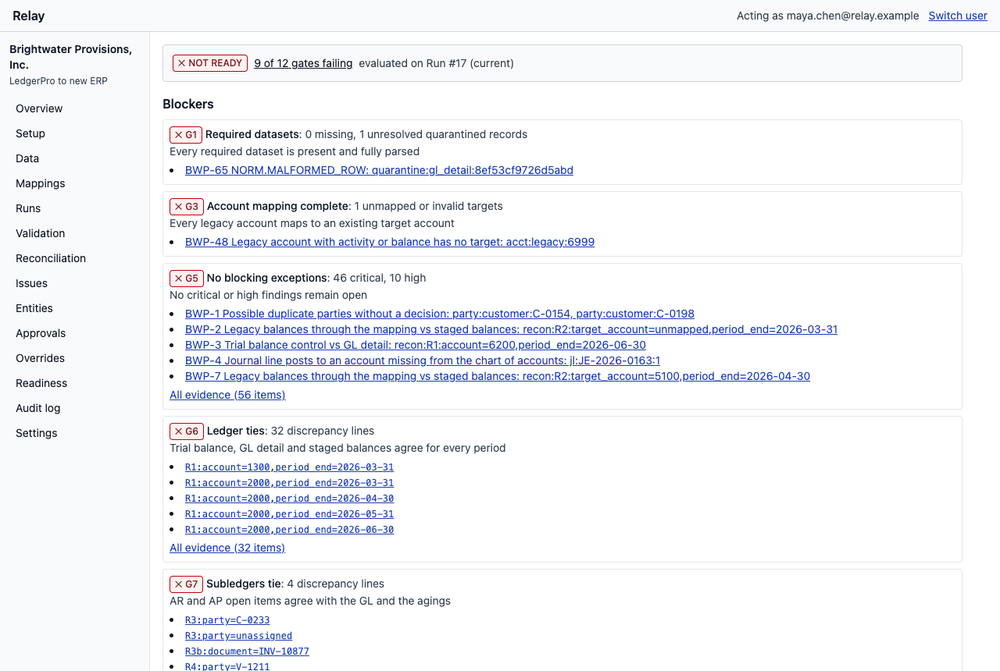
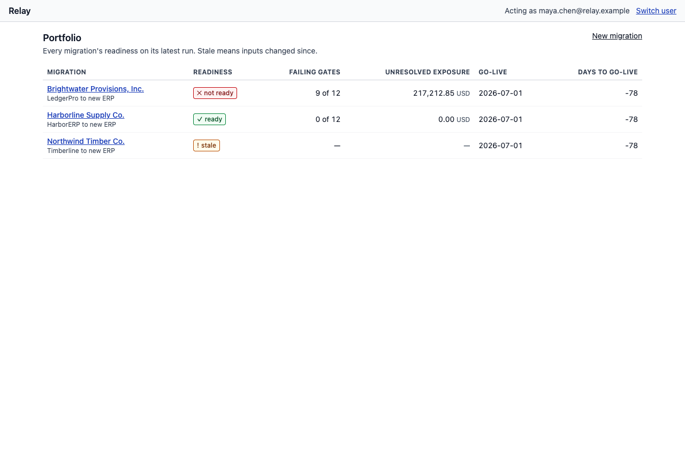
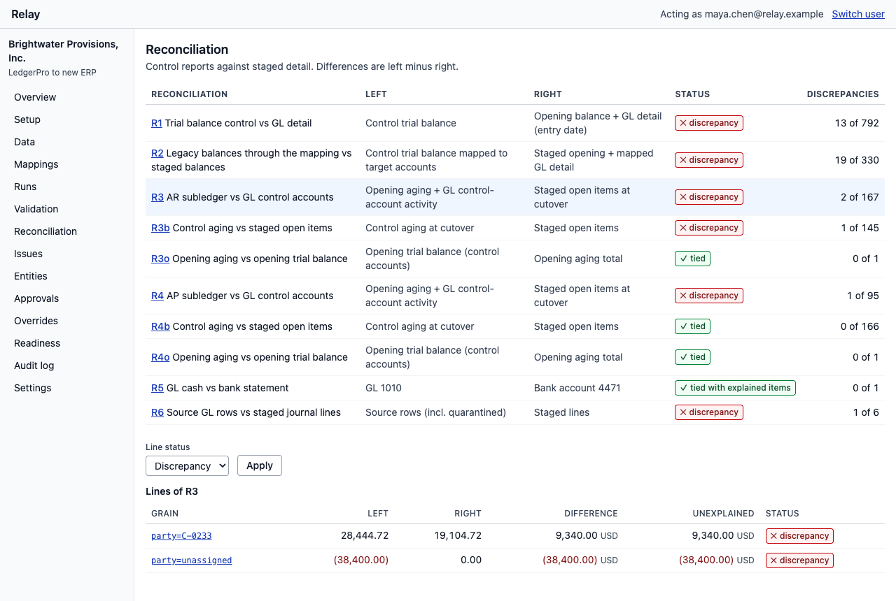
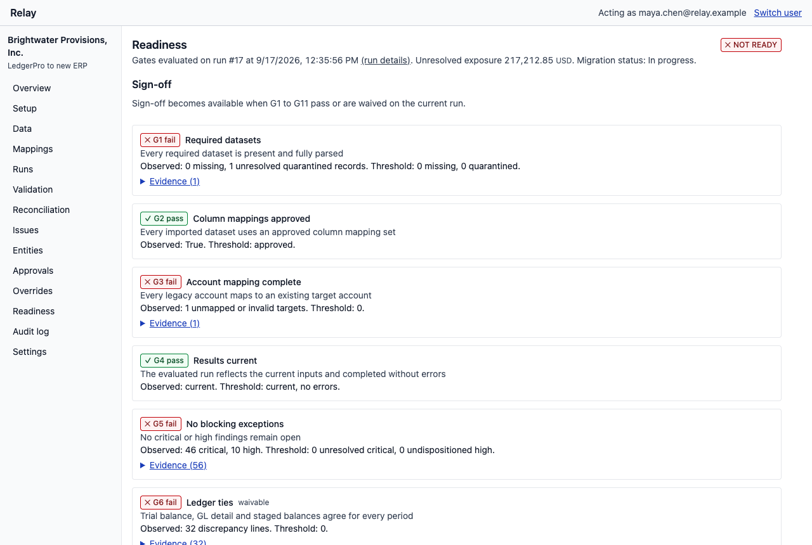
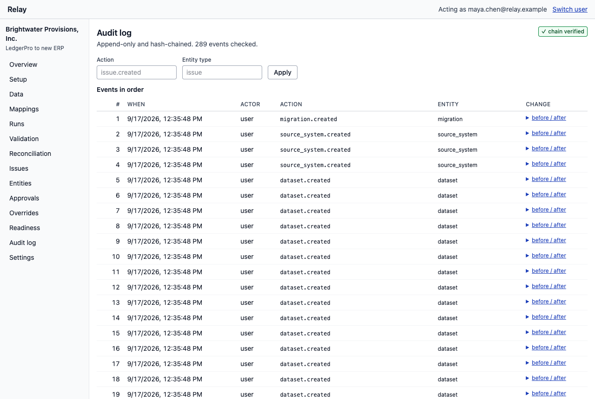
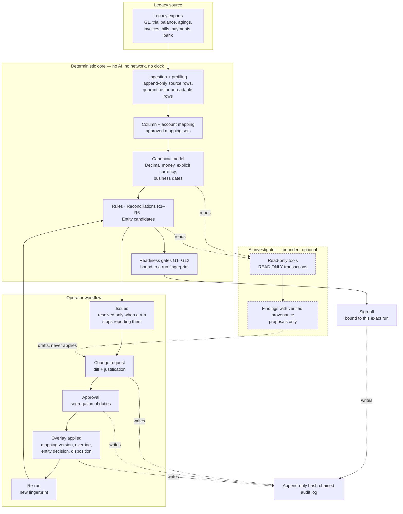

# Relay

**Migration operations for ERP implementations: prove the data is right before go-live.**

Moving a company onto a new ERP is not importing CSVs. Legacy exports quietly drop records.
Mappings put contra-accounts in the wrong place. Old books carry duplicate vendors and double
payments. Fixes happen in spreadsheets nobody can audit. And the go-live decision usually comes down
to "looks good" in a meeting.

Relay replaces that meeting with evidence: deterministic validation and reconciliation against
independent control reports, every fix routed through an approved change request, an append-only
hash-chained audit trail, and explicit readiness gates bound to a reproducible pipeline run. An AI
investigator helps explain discrepancies, with read-only tools and verified citations — and removing
it removes no correctness.

> **Status:** M0–M9 complete, then six review passes and a second-company generalization test.
> [docs/progress.md](docs/progress.md) records what exists, what was measured, and what was cut.

**What this is, precisely:**

| | |
|---|---|
| **Brightwater Provisions, Inc.** | A fictional demo customer. Every company, person, account and figure in it is invented; no real financial or customer data was used at any point. |
| **Kestrel Instruments Ltd** | A second fictional company used only to test that the engine generalizes. It is an evaluation scenario, generated and verified from the command line — not a second demo, and not exposed in the UI. |
| **The engine** | Deterministic. Same inputs, same fingerprint, same results — asserted by tests, not by claim. |
| **The AI investigator** | Passes six scripted-provider evals. **No live-model run has ever been recorded**, so nothing here demonstrates a model's real accuracy on this data. It is off by default. |
| **Deployment** | None. This runs locally under Docker Compose; the development identity switcher is not authentication. |
| **Known limitations** | Listed honestly in [docs/traceability.md](docs/traceability.md) — including one security requirement (separate database roles) that is deliberately not implemented. |



### What is technically interesting

- **A deterministic engine with hand-written ground truth.** 37 rules, ten reconciliations and
  twelve readiness gates are pure functions of a fingerprinted input set. The expected results were
  written by hand from the accounting specification *before* the engine ran, and have never been
  edited to match its output — so a disagreement is an investigation, not a diff to accept.
- **A second company proves it generalizes.** Kestrel Instruments Ltd shares nothing with the demo
  customer — different legacy system, delimiter, encoding, date and amount formats, currency, fiscal
  year, chart of accounts and defects — and runs through the same unchanged engine. Building it
  found three real engine bugs.
- **Corrections are governed, not edited.** Source rows are append-only. Every fix is an overlay
  created by an approved change request, with segregation of duties enforced server-side, and the
  run that follows is what changes the numbers.
- **Evidence all the way down.** Every gate links to the reconciliation line, every line to the
  records, every record to the file and line number it came from.
- **AI is bounded by construction.** The investigator may import read models only — enforced by
  import-linter — its tool sessions are `READ ONLY` transactions, its findings must pass provenance
  verification, and it can never be a requester or an approver.

---

## The ten-minute demo

```bash
make setup
```

```bash
make up
```

```bash
make demo-reset
```

`make demo-reset` recreates the local database and loads Brightwater at its "day 9" state through
the real services — uploads, approved column mappings, an approved account mapping, a pipeline run —
acting as the seeded people, never writing tables directly. Optionally add two more fictional
migrations (one signed off, one in its first week) with `make demo-portfolio`.

Open http://127.0.0.1:3000 and sign in as any of the seeded people (development identity, local
only: Maya the implementation specialist, Daniel the lead, Priya the customer controller, Sam a
viewer, Alex an admin).

| # | Step | What it shows |
|---|---|---|
| 1 | **Portfolio → Brightwater** | Readiness per migration, days to go-live, exposure |
| 2 | **Overview blockers** | Nine of twelve gates failing, each with the evidence behind it |
| 3 | **Reconciliation → R3** | AR subledger vs GL: `party=unassigned` differs by (38,400.00), `C-0233` by 9,340.00 |
| 4 | **Drill into `C-0233`** | Down to invoice `INV-10877`, present in the GL and the aging, missing from the invoice export — with the source file and line number |
| 5 | **Mappings** | Legacy 1205 (an allowance, a contra-asset) mapped into 1200 Accounts Receivable, flagged as a subtype conflict |
| 6 | **Propose the fix** | Maya drafts and submits a change request. She cannot approve it — the button is absent and the API refuses. Daniel and Priya approve; the run re-queues automatically |
| 7 | **Re-upload the corrected invoice export** | The same file twice changes nothing; the corrected export supersedes the active import and R3b ties |
| 8 | **Entities** | Merging two vendor records reveals a double payment that was hidden by the duplicate; disposition it as a carry-forward adjustment |
| 9 | **Audit log** | Who changed what, when, why, with before/after and both approvers; the hash chain verifies |
| 10 | **Readiness → sign-off** | `make demo-fast-forward` applies the remaining documented fixes as the seeded people; sign off, and watch a later policy change invalidate the sign-off |

Steps 2–10 are covered end to end by the Playwright suite (`make test-e2e`, 12 specs, about three
minutes on this machine), so the demo path is tested, not rehearsed prose.

| | |
|---|---|
|  |  |
|  |  |

---

## What it does

- **Import** legacy ledgers, subledgers, control reports and bank data. Source rows are immutable
  and keep their file and line lineage; malformed rows are quarantined, never guessed at.
- **Map** source columns and legacy accounts onto a canonical model and a target chart of accounts,
  through versioned mapping sets that only an approved change request can activate.
- **Validate** with 37 deterministic rules (balanced entries, period vs date, duplicates, unapplied
  cash, FX consistency, instruction-like text in free fields, …).
- **Reconcile** against independent control reports: trial balance vs GL detail, legacy balances
  through the mapping, AR and AP subledgers and agings, cash vs the bank statement, and source rows
  vs staged lines. Every discrepancy drills down to the records behind it.
- **Govern** every correction as a change request with segregation of duties, staleness detection,
  atomic apply and an audit event written in the same transaction.
- **Investigate** with an AI agent that reads through read-only tools, cites evidence the server
  verifies, and can only propose: a person becomes the requester of record, and a different person
  approves.
- **Decide** go-live with twelve gates evaluated on a reproducible run, scope-bound waivers that
  lapse when the waived amounts change, and a sign-off invalidated by any later input change.

Nothing in the engine knows anything about Brightwater: the demo's defects are found by general
rules, and import-linter contracts plus scenario tests keep it that way.

---

## Verification

```bash
make check
```

Formatting, lint, import contracts, `mypy --strict`, `tsc`, backend unit/property/scenario tests,
web unit tests, fixture determinism, golden-manifest verification, integration tests against real
PostgreSQL, the Next.js production build and Compose config validation.

```bash
make test-all
```

Everything above, then the stack built and seeded, smoke-tested, and the full Playwright suite.

Most recent run on this machine (Apple M2, 8 cores, 16 GB, macOS 14.5):

| Suite | Result |
|---|---|
| Unit, property and scenario | 1,041 passed |
| Integration (real PostgreSQL) | 115 passed |
| Web unit | 43 passed |
| Golden manifest (Brightwater) | 115 of 115 checks |
| Second company (Kestrel) | 31 of 31 expectations |
| End to end (Playwright, seeded stack) | 12 specs passed |

The golden manifest is hand-authored from the accounting specification and is never updated to match
the engine; [docs/decisions/0002](docs/decisions/0002-brightwater-spec-corrections.md) records the
one time truth changed, and why.

**A second company** answers the question the manifest cannot: did the engine generalize, or did it
learn Brightwater? Kestrel Instruments Ltd exports from a different legacy system — semicolons and a
byte-order mark, `DD.MM.YYYY`, `1.234,56`, one signed GL amount column, EUR with USD suppliers, a
July fiscal year — with its own chart of accounts, parties, documents and defects, and is run
through the unchanged runtime engine. It met 31 of 31 expectations, and finding those required
fixing three genuine engine bugs, none of which mentions a company
([docs/decisions/0011](docs/decisions/0011-second-company-generalization.md)).

Measured performance on a synthetic 250,000-line migration (`make pipeline-perf`,
`make engine-perf`) is in [docs/progress.md](docs/progress.md#m9--hardening-and-demo-rehearsal).

---

## How it is put together

| Layer | Contents |
|---|---|
| `backend/src/relay/` | Modular monolith. Pure core (`core`, `canonical`, `ingestion`, `mapping`, `profiling`, `engine`), database modules (`imports`, `mapping_sets`, `changes`, `issues`, `pipeline`, `investigations`, `audit`, `identity`, `workspace`, `jobs`), edges (`api`, `worker.py`, `cli.py`), and `ai` — which may import read models only |
| `backend/src/relay_scenarios/` | The fictional data generators and demo tooling (they know the planted defects) |
| `backend/src/relay_evaluation/` | Golden manifest, reference oracle, verifier, investigator evals (never imported by runtime code) |
| `web/` | Next.js App Router over the API: Server Components for reads, Server Functions for governed writes, no client-side money arithmetic |
| `docs/` | Specifications, decision records, progress log, requirement traceability |

Import-linter enforces the layering, and the runtime package may not import the scenario or
evaluation packages at all.



The dashed path is the only thing AI touches: it reads, and it may draft a change request that a
person still has to submit and that two other people still have to approve. It cannot write, cannot
approve, cannot change an issue, and cannot make a gate pass. Turning it off (`RELAY_AI_PROVIDER=disabled`,
the default) removes no workflow — which the end-to-end suite asserts.

Stack: Python 3.12, FastAPI, SQLAlchemy 2.0 (sync), PostgreSQL 16, Alembic, Pydantic v2;
Next.js 16, React 19, TypeScript strict, Tailwind 4; Docker Compose; uv and npm with committed
lockfiles.

---

## Running it

**Prerequisites:** [uv](https://docs.astral.sh/uv/) 0.12+, Node.js 24 with npm, Docker with
Compose v2, GNU make (or macOS make).

| Command | What it does |
|---|---|
| `make setup` | Install backend and web dependencies from the lockfiles |
| `make up` / `make down` | Build and start (or stop) the whole stack; `make smoke` checks it end to end |
| `make demo-reset` | Recreate the database and seed Brightwater at its day-9 state |
| `make demo-portfolio` | Add two more fictional migrations (one signed off, one early stage) |
| `make demo-fast-forward` | Apply the documented resolutions as the seeded people, leaving only sign-off |
| `make dev` | API and web on the host with reload, PostgreSQL in Compose |
| `make test-e2e` | Playwright against the running, seeded stack (uses local Chrome) |
| `make verify-audit` | Recompute every audit hash chain |
| `make eval-ai-scripted` | Investigator evals with the scripted provider (no model calls) |
| `make help` | Everything else |

Host ports default to 3000 (web), 8000 (API) and 55432 (database); override them in `.env`.

The Compose project is named `relay`, so every clone of this repository shares one stack: running
`make up` from a second clone replaces the first one's containers, and `docker compose down -v`
destroys the shared database volume. Work from one clone, or set `COMPOSE_PROJECT_NAME` yourself.

AI is **off** unless configured: set `RELAY_AI_PROVIDER=anthropic` with `ANTHROPIC_API_KEY`, and
record the customer's consent for a migration as an approved policy change. With no provider, every
workflow still works — that is asserted by an end-to-end test.

> Relay is a portfolio project built to production standards, not a deployed product. The
> development identity is not authentication; do not put real data in it. Known limitations are
> listed in [docs/traceability.md](docs/traceability.md).

---

## Documentation

| Doc | Contents |
|---|---|
| [docs/progress.md](docs/progress.md) | What has been built per milestone, measured results, deviations |
| [docs/product-spec.md](docs/product-spec.md) | Problem, critique of the brief, MVP scope, UX |
| [docs/architecture.md](docs/architecture.md) | System design, modules, pipeline, API, jobs |
| [docs/data-model.md](docs/data-model.md) | Domain model and schema |
| [docs/validation-and-reconciliation.md](docs/validation-and-reconciliation.md) | Rules, reconciliations, entity resolution |
| [docs/governance.md](docs/governance.md) | Issues, change requests, approvals, audit, readiness gates |
| [docs/ai-safety.md](docs/ai-safety.md) | AI boundaries, tools, verification, threat model, evals |
| [docs/demo-scenario.md](docs/demo-scenario.md) | The Brightwater scenario and its expected results |
| [docs/testing.md](docs/testing.md) | Test strategy and layers |
| [docs/security-and-correctness.md](docs/security-and-correctness.md) | Requirement IDs |
| [docs/traceability.md](docs/traceability.md) | Every requirement ID mapped to its tests or a stated limitation |
| [docs/review-findings.md](docs/review-findings.md) | The six review passes: what was found, fixed, or deliberately left |
| [docs/implementation-plan.md](docs/implementation-plan.md) | Milestones and acceptance criteria |
| [docs/decisions/](docs/decisions/) | Decision records (0001–0011) |
| [CLAUDE.md](CLAUDE.md) | Working rules for contributors and AI coding sessions |
