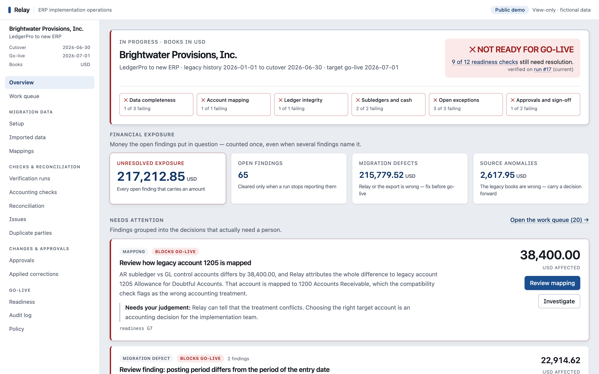
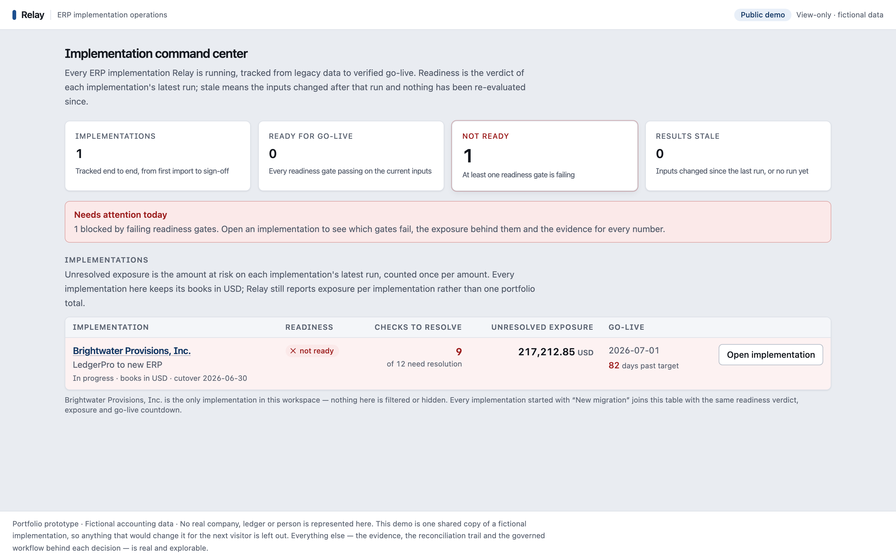
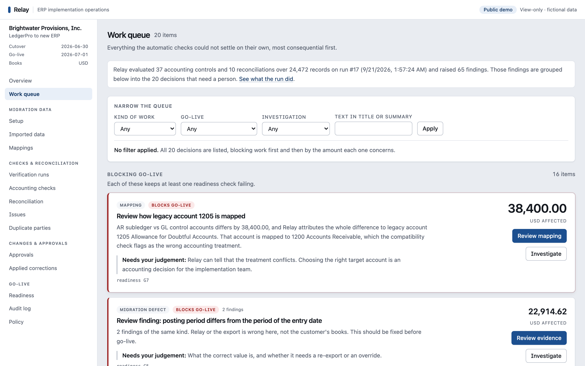
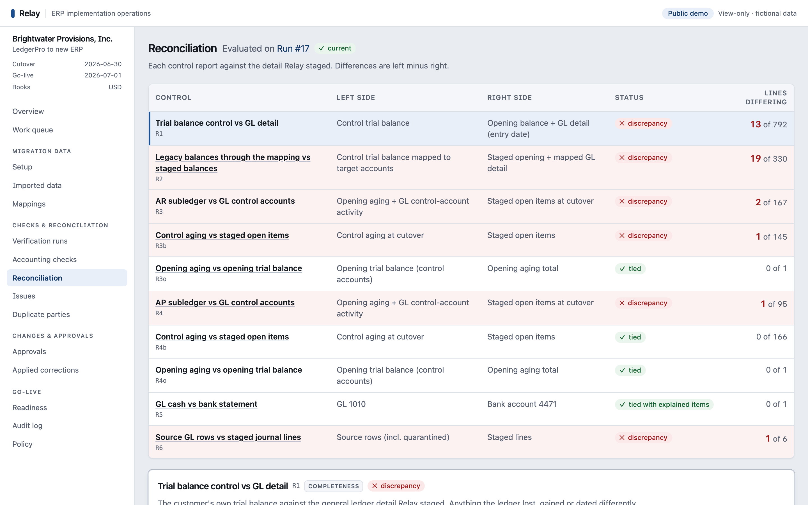
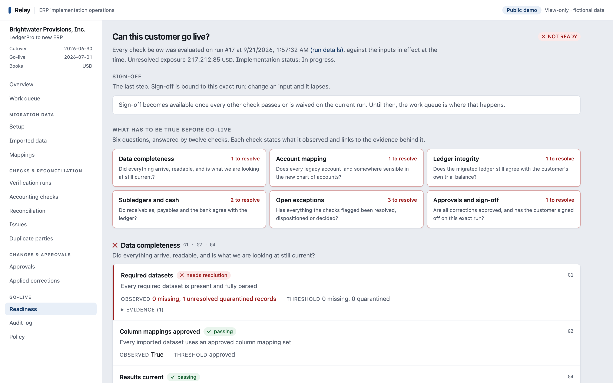
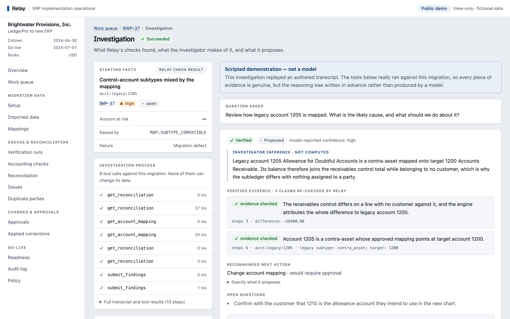
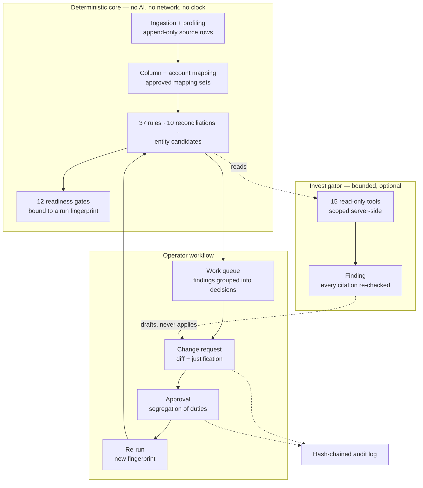

# Relay

**An implementation-operations system for getting legacy accounting data through migration QA to a
verified ERP go-live.**

**Live demo:** https://web-production-9032d5.up.railway.app &nbsp;·&nbsp;
**Code:** https://github.com/yds233013/relay

> Independent portfolio prototype. Every company, person, account and figure in it is fictional,
> and it describes no real company's systems. The demo's AI investigator is a **scripted
> demonstration — not a model**.



---

## The problem

An ERP implementation team has to move messy legacy accounting data into a new system and then
answer one question: *is this migration actually safe to launch?* Today that answer is assembled
by hand — spreadsheets comparing exports against trial balances, mapping reviews in email, fixes
applied straight to staging data, and a go-live decision that comes down to "looks good" in a
meeting.

## What Relay does

Relay takes legacy accounting data through deterministic validation, reconciliation,
investigation, governed remediation and verified launch readiness:

**Import → Profile → Map → Normalize → Validate → Reconcile → Investigate → Resolve / Approve →
Verify → Launch**

- **Imports** legacy ledgers, subledgers, control reports and bank data. Source rows are immutable
  and keep their file and line; unreadable rows are quarantined, never guessed at.
- **Maps and normalizes** columns and legacy accounts onto a canonical model and a target chart of
  accounts, through versioned mapping sets.
- **Validates and reconciles** with 37 deterministic rules and 10 reconciliations against the
  customer's own control reports. Every discrepancy drills down to the records and source lines
  behind it.
- **Turns failures into a work queue**: 65 findings become the 20 decisions a person actually has
  to make, blocking work first, each with the money attached.
- **Investigates** with a bounded investigator that traces an issue back to evidence and drafts a
  fix.
- **Governs** every correction as a change request that people other than the requester must
  approve, then **re-runs** the deterministic checks to prove the fix worked.
- **Decides go-live** with 12 readiness gates on a reproducible run, and records all of it in an
  append-only, hash-chained audit log.

## The design principle

Deterministic software detects and verifies financial failures. The bounded investigator does the
expensive evidence gathering and proposes a resolution. Humans keep authority over every material
change. Then the system re-runs its deterministic controls to verify the approved fix.

Turning the AI off removes no correctness — the end-to-end suite runs the whole product with it
disabled.

## Why I built it

Data migration is where ERP implementations are won or lost, and most of the work is repeatable:
comparing exports, chasing differences, proving a fix held. I wanted to see how much of that loop
can be automated **without** handing judgement or authority to a model — software doing the
checking and the evidence gathering, people making the calls, and every number traceable back to a
line in a file.

---

## A tour

| | |
|---|---|
|  |  |
|  |  |

The investigation page is where the whole loop becomes visible on one screen: the deterministic
finding it started from, every read-only tool call, the investigator's reading of that evidence
kept visually separate from it, Relay's verdict on each claim, and the decision left to a person.



More screens — the work-item detail, the record inspector, a change request through its whole
lifecycle, and the audit log — are in [docs/images/](docs/images/). A three-minute walkthrough of
the live demo is in [docs/demo-script.md](docs/demo-script.md).

---

## Architecture



A modular monolith: a pure deterministic core (no database, I/O, clock or randomness), database
modules around it, and FastAPI, a PostgreSQL-backed job worker and a Next.js front end at the
edges. Import contracts enforce the layering, and the investigator's package may import read
models only.

**Live deployment (Railway):**

| | |
|---|---|
| `web` | Next.js — the only public service, HTTPS via Railway's edge |
| `backend` | FastAPI API and the job worker, one private service beside one volume for stored files |
| `Postgres` | Private; no public access |
| Mode | `RELAY_ENV=demo` — anonymous, read-only, every mutation refused except starting an investigation |
| AI | `RELAY_AI_PROVIDER=demo` — scripted replay, no API key, no model calls, no cost |

Details and the reasoning behind them: [docs/railway-deployment.md](docs/railway-deployment.md).

**Stack:** Python 3.12, FastAPI, SQLAlchemy 2.0, PostgreSQL 16, Alembic, Pydantic v2; Next.js 16,
React 19, TypeScript, Tailwind 4; Docker; Playwright.

## The AI investigator

It sits at the *investigate* step and nowhere else. It reads through 15 read-only tools that the
server scopes to one migration and one run; its database sessions are `READ ONLY` transactions. It
returns a structured finding, and Relay checks every quoted value and record it cites against the
tool results before the finding can be promoted to a draft change request. It can propose a
correction but cannot make one, approve one, or change a single financial record.

In the public demo the investigator is a **scripted demonstration — not a model**, and the page
says so. The *reasoning* is an authored transcript written in advance. Everything around it is
real: the same tools execute against the real database, the evidence is genuine, and the same
verification runs over every claim. What is replayed is the argument, not the evidence. No
live-model run has been recorded, so nothing here measures any model's accuracy.

## Governance and auditability

- **Corrections are overlays.** Source rows are never edited; a fix is a mapping version, record
  override, entity decision or disposition created only by an approved change request.
- **Segregation of duties** is enforced server-side: the requester can never approve, and material
  changes need both the implementation lead and the customer controller.
- **Verified, not ticked off.** An issue is resolved only when a fresh deterministic run stops
  reporting it. Nobody marks it resolved by hand.
- **Every governed mutation writes an audit event in the same transaction**, chained by hash so
  tampering is detectable. Sign-off is bound to one exact run and lapses if any input changes.

## Evaluation and testing

The expected results were **written by hand** from the accounting specification before the engine
ran, and have never been edited to match its output — so a disagreement is an investigation, not a
diff to accept.

A **second fictional company** answers the question the first cannot: did the engine generalize, or
did it learn the demo? Kestrel Instruments Ltd comes from a different legacy system — different
delimiter, encoding, date and number formats, currency, fiscal year, chart of accounts and defects —
and runs through the same unchanged engine. Building it found three real engine bugs.

| Suite | Result |
|---|---|
| Unit, property and scenario | 1,096 passed |
| Integration (real PostgreSQL) | 135 passed |
| Web unit | 46 passed |
| Hand-written expected results (Brightwater) | 115 of 115 checks |
| Second company (Kestrel) | 31 of 31 expectations |
| End to end (Playwright, seeded stack) | 12 specs passed |

All of it runs in [GitHub Actions](https://github.com/yds233013/relay/actions) on every push to
`main`.

---

## Running locally

**Prerequisites:** [uv](https://docs.astral.sh/uv/) 0.12+, Node.js 24 with npm, Docker with Compose
v2, make.

```bash
make setup        # install backend and web dependencies from the lockfiles
make up           # build and start the stack
make demo-reset   # create the database and seed the fictional demo customer
```

Open http://127.0.0.1:3000 and pick a seeded person to act as (a development convenience, not
authentication). `make demo-up` runs the anonymous public-demo mode instead; `make check` runs the
full verification suite; `make help` lists everything else.

---

## Documentation

| | |
|---|---|
| [docs/demo-script.md](docs/demo-script.md) | A three-minute walkthrough of the live demo |
| [docs/project-brief.md](docs/project-brief.md) | One-page summary of the project |
| [docs/product-spec.md](docs/product-spec.md) | Scope and product behaviour |
| [docs/architecture.md](docs/architecture.md) | System design, modules, API, jobs |
| [docs/validation-and-reconciliation.md](docs/validation-and-reconciliation.md) | Rules, reconciliations, entity resolution |
| [docs/governance.md](docs/governance.md) | Change requests, approvals, audit, readiness gates |
| [docs/ai-safety.md](docs/ai-safety.md) | Investigator boundaries, tools, verification, evals |
| [docs/public-demo.md](docs/public-demo.md) | What an anonymous visitor may do, and what stops them |
| [docs/railway-deployment.md](docs/railway-deployment.md) | The live deployment |
| [docs/public-deployment.md](docs/public-deployment.md) | Alternative: the same demo on a single VM behind Caddy |
| [docs/traceability.md](docs/traceability.md) | Every requirement mapped to its tests, or a stated limitation |
| [docs/progress.md](docs/progress.md) | What was built, measured and cut, milestone by milestone |
| [docs/decisions/](docs/decisions/) | Decision records |

## License

[MIT](LICENSE) — Copyright (c) 2026 Yash Shah. The fictional accounting data in `fixtures/` is
generated by this repository and describes no real company, person, account or transaction.
